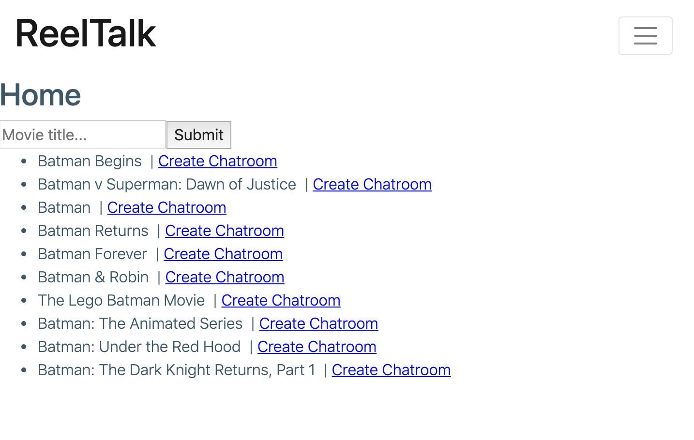
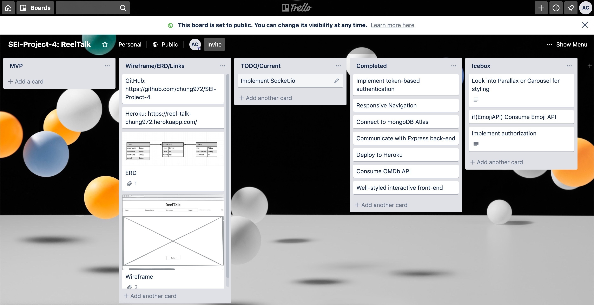

# 🎥 **ReelTalk** 🎞️ 🍿🎬

## Introduction:
Ever have those moments when you want to gush about an awesome movie or show that you *just* finished watching? Look no further! **ReelTalk** connects you with other avid fans so you *can* have those extended conversations.

## Technologies Used:
- **M**ongoDB/Mongoose
- **E**xpress
- **R**eact
- **N**ode
- Pusher ChatKit SDK
- OMDB API
- Boot/reactstrap

## Getting Started:
- [ReelTalk](https://reel-talk-chung972.herokuapp.com/)

- [Trello](https://trello.com/b/uEOF1Igu/sei-project-4-reeltalk)

## Unsolved Problems:
- Unable to implement group chat functionality
- Unable to implement param matching with react-router-dom

## Future Enhancements:
- Allow users to save their chatrooms
- Allow users to perform CUD operations on messages
- Display most populated chatboards
- Add a carousel (see Bootstrap or Materialize) of most popular chatboards
- Have a link on the NavBar that will take you to a random chatboard

